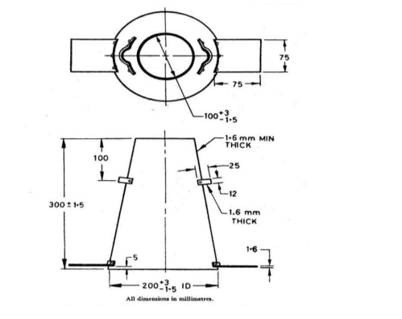
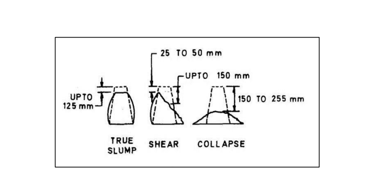

import AltSlashPopup from '@site/src/components/alt_slash_component';

<AltSlashPopup/>

You can use these links to navigate to each section of the syllabus.

## Concrete

1. **Definition of Concrete:** Concrete is a composite material consisting of cementing materials (like cement or lime), sand, crushed stones or gravels, and water. It becomes solid through a hardening process and can include additives known as admixtures for specific purposes.

2. **Versatile Construction Material:** Concrete is a widely used construction material in various applications, including buildings (from foundations to topmost floors), transportation infrastructure (roads, pavements, highways, airports), water storage and transport (canals, dams, water treatment plants), and for specialized purposes like waterproofing and fireproofing.

3. **Diverse Applications:** It is utilized extensively in construction projects ranging from buildings and roads to tunnels, reservoirs, and even in shielding against radiations in facilities like X-ray and atomic power plants. Concrete plays a vital role in modern construction and infrastructure development.

:::tip

You can use mnemonic ` CVD ` to remember above points

  
 Click to expand? For what it stands for 

**C** - Composite Material: Concrete is a composite material consisting of cementing materials (like cement or lime), sand, crushed stones or gravels, and water. It becomes solid through a hardening process and can include additives known as admixtures for specific purposes.

**V** - Versatile in Construction: Concrete is a widely used construction material in various applications, including buildings (from foundations to topmost floors), transportation infrastructure (roads, pavements, highways, airports), water storage and transport (canals, dams, water treatment plants), and for specialized purposes like waterproofing and fireproofing.

**D** - Diverse Applications: It is utilized extensively in construction projects ranging from buildings and roads to tunnels, reservoirs, and even in shielding against radiations in facilities like X-ray and atomic power plants. Concrete plays a vital role in modern construction and infrastructure development.

:::

### Ingredients of Concrete

1. **Cement:** Cement is like the glue in concrete. It sticks the small and big pieces together when it dries and becomes hard.

2. **Fine Aggregates:** These are tiny particles that fill the gaps between the big pieces. They make the concrete solid by reducing empty spaces.

3. **Coarse Aggregates:** These are the big pieces in concrete. They provide the strength and support to the concrete.

4. **Water:** Water helps mix everything together. It reacts with the cement to make it hard and makes the concrete easier to work with.

5. **Admixtures:** Admixtures are like special helpers. They are added to concrete to make it better for certain jobs. They can change how it flows, how fast it hardens, and even make it stronger.

## Grades Of Concrete   

Concrete grades, represented by the "M" followed by a number (e.g., M10, M20, etc.), indicate the characteristic compressive strength of concrete cubes at 28 days of curing. Here's a brief explanation of each grade:

| **Grade of Concrete (M)** | **Characteristic Compressive Strength (N/mm²)** | **Proportion (Cement:Sand:Aggregate)** |
|---------------------------|--------------------------------------------------|-----------------------------------------|
| M10                       | 10                                               | 1:3:6                                   |
| M15                       | 15                                               | 1:2:4                                   |
| M20                       | 20                                               | 1:1.5:3                                 |
| M25                       | 25                                               | 1:1:2                                   |
| M30                       | 30                                               | 1:0.75:1.5                              |
| M35                       | 35                                               | 1:0.7:1.4                               |
| M40                       | 40                                               | 1:0.5:1                                 |

### Proportions for Nominal Mix Concrete

Certainly! In concrete, the proportions of its ingredients (cement, sand, and coarse aggregates) are critical for its properties. This process is called mix `Proportioning` or mix design. .

Nominal mix concrete is a type of concrete mix design that uses specific ratios of ingredients by volume without precisely determining the individual weights of each component. In nominal mix concrete, the proportions of cement, sand, and coarse aggregates are specified in terms of volume, typically represented as ratios like 1:2:4 or 1:3:6.

For example, in a 1:2:4 nominal mix concrete, it means that:

- 1 part of cement is mixed with
- 2 parts of sand and
- 4 parts of coarse aggregates (such as crushed stone or gravel)

These ratios are specified for common construction purposes and are easy to follow without the need for detailed measurements of the weight of each ingredient. Nominal mix concrete is suitable for many general construction applications, but it may not provide precise control over concrete properties like strength and workability compared to a designed mix concrete, where the proportions are determined more precisely based on desired performance characteristics.

## Workability and compressive Strength of Concrete

Workability refers to how easy it is to mix, handle, transport, place, and compact concrete. It's all about how manageable and cooperative the concrete is during construction.

1. **Water Content:** The amount of water in the mix is a crucial factor. Too much water can lead to problems like bleeding (excess water coming to the surface) and segregation (aggregate separating from finer materials), which weaken the concrete.

2. **Bleeding:** Bleeding occurs when there's too much water in the mix, and it causes small pores on the concrete's surface. This is not good for concrete quality.

3. **Segregation:** Segregation happens when aggregates separate from the finer materials in the mix, creating gaps and reducing durability and strength. It's something we want to avoid.

4. **Complex Factors:** Workability depends on two critical factors: consistency (how thick or thin the mix is) and homogeneity (how well the materials are evenly mixed). Finding the right balance between these factors is essential for good workability.

## Tests For Workability

### The slump test
Slump test is probably the simplest and commonly used test, though it is not the true guide to workability. 

In this test, concrete is compacted in vessel of the shape of the frustum of a cone and open at both the ends. 
- Concrete is compacted with the help of standard tamping rod, in four equal layers. 
- Immediately after the vessel filled, it is raised vertically, without giving any jerk.
- The concrete in the vessel become free and therefore slumps.
- The vertical settlement, measured in mm, is termed as slump

- Despite its popularity, it is not completely suitable for deciding mix designs of concrete.
- The shape of the slump is not consistent in all cases. In fact three types of slumps have been 
observed to occur.

- **True slump**. Where sliding is equal throughout the cone.
    
- **Shear slump**. Where one half from the top fails by shear and slides to one side reduction in height is different in different directions.
    
- **Collapse slump**. This occurs in concrete of high water content the material almost unequally in all directions.

### Factors effecting Workability

The workability of concrete is influenced by various factors, and it's essential to consider these factors to achieve the desired level of workability for a specific construction application. 

1. **Water-Cement Ratio:** The amount of water in the mix is a crucial factor. Increasing water content generally improves workability, but excessive water can lead to issues like bleeding and segregation.

2. **Cement Content:** The type and amount of cement used can impact workability. Higher cement content can make the mix stickier and less workable.

3. **Aggregate Properties:** The shape, size, and grading of aggregates play a significant role. Well-graded, rounded aggregates typically enhance workability compared to angular or poorly graded ones.

4. **Admixtures:** The use of chemical admixtures can modify concrete's properties. Plasticizers, superplasticizers, and air-entraining agents can improve workability.

5. **Mix Proportions:** The ratio of cement, sand, and aggregates in the mix affects workability. Adjusting these proportions can either increase or decrease workability.

6. **Mixing Time and Method:** Proper and consistent mixing is crucial. Undermixing or overmixing can affect workability. A longer mixing time can improve workability to some extent.

7. **Temperature:** High temperatures can lead to faster setting times, reducing workability. Conversely, very low temperatures can increase viscosity and affect workability negatively.

8. **Humidity and Ambient Conditions:** The humidity and weather conditions during mixing and placement can impact workability. Windy or dry conditions can accelerate moisture loss.

:::info

## Determination Compressive Strength 

**Apparatus: the Testing machine.**

The testing machine may be of any reliable type of sufficient capacity for the tests and capable of 
applying the load at the specified rate. The permissible error shall not be greater than 2 percent of 
the maximum load. 

**Age at test:**
Test shall be made at recognized ages of the test specimens, the most usual being 3, 7 and 28 days. 
The ages shall be calculated from the time of the addition of water of the dry ingredients.

**Number of Specimens:**
At least three specimens preferably from different batches shall be made for testing at each selected 
age.

**Curing of test specimen:**
The test specimens are stored in place free from vibration, in moist air of at least 90% relative 
humidity and at a temperature of 27º ± 2º C for 24 hours. 

**Procedure:**
1. Specimens stored in water shall be tested immediately on removal from the water. The 
dimensions of the specimens and their weight shall be noted before testing.
2. Placing the specimen in the testing machine the bearing surface of the testing which is to 
be in contact with the compression platens. 
3. In the cubes specimen shall be placed in the machine in such a manner that the load shall 
be applied to opposite sides of the cubes as cast that is not to the top and bottom. The axis 
of the specimen shall be carefully aligned with the center of thrust of the spherically seated 
platen. 
4. The load shall be applied without shock and increased continuously at a rate of 
approximately 140 kgcm²/min until the resistance of the specimen to the increasing load 
breaks down and no greater load can be sustained. 
5. The maximum load applied to the specimen shall then be recorded and the appearance of 
the concrete and any unusual features in the type of failure shall be noted.

**Calculation:**
The measured compressive strength of the specimen shall be calculated by dividing the maximum 
load applied to the specimen during the least by the cross sectional area calculated from the mean 
dimensions of the section and shall be expressed to the nearest kg per square cm or **N/mm^2**
. 
Average of three values shall be taken as the representative of the batch provided the individual 
variation is not more than ± 15 percent of the average. Otherwise repeat tests shall be made.

:::

### Curing Of Concrete

Cement concrete has to be kept wet for a few days after its placement to ensure complete setting 
and hardening of cement. Curing is the term used for the job of keeping the fresh concrete wet till 
the desired purpose of ensuring complete setting and hardening of cement in the concrete is 
achieved

- **Moisture:** Curing keeps concrete wet to aid in the chemical process that makes it strong.
- **Temperature:** It controls temperature to prevent extreme heat or cold, which can harm concrete.
- **Duration:** Curing lasts for at least seven days but can vary depending on factors.
- **Drying Protection:** It shields concrete from rapid drying due to sun, wind, or heat.
- **Timing:** Curing begins soon after concrete is placed and has set enough to withstand it.
- **Quality:** Proper curing is crucial for concrete's strength, durability, and performance.

### Methods For Curing Of Concrete 

 There are several methods for curing concrete, each designed to maintain the necessary moisture and temperature conditions to ensure proper hydration and the development of strength and durability. Here are some of the common methods of curing concrete:

1. **Water Curing:** This is one of the most traditional methods. It involves keeping the concrete continuously wet by spraying, ponding, or soaking it with water. Wet burlap or other wet coverings may be used to maintain moisture. Water curing is effective but can be labor-intensive.

2. **Membrane Curing:** Membrane curing involves the use of curing compounds or liquid membranes that form a film on the concrete surface. These compounds seal in moisture and prevent rapid evaporation. They come in both clear and pigmented forms and are easy to apply.

3. **Covering with Wet Materials:** Another method is to cover the concrete with wet materials such as wet burlap, cotton mats, or other fabric materials. These materials are kept continuously wet to maintain moisture in the concrete.

4. **Plastic Sheeting:** Concrete can be covered with plastic sheets to create a barrier that prevents moisture loss. This method is cost-effective and straightforward but may require careful sealing of the edges to prevent air and moisture from escaping.

5. **Ponding:** Ponding involves creating shallow ponds or reservoirs around the concrete surface and filling them with water. The water serves as a continuous moisture source and helps in curing.

6. **Steam Curing:** In some cases, steam may be used to accelerate the curing process, especially in precast concrete manufacturing. Steam curing provides controlled temperature and moisture conditions for faster strength development.

7. **Spraying and Fogging:** Spraying or fogging the concrete surface with a fine mist of water at regular intervals helps maintain moisture and prevent rapid drying.

## Foundation

Here's a definition of the foundation of a building in four points:

1. **Substructure:** The foundation of a building is the lower part, known as the substructure, hidden below ground level. It serves as the strong and stable base on which the entire building rests.

2. **Plinth:** The foundation includes a portion called the plinth, which is the visible part of the substructure just above the ground. It acts as a transition between the substructure and the superstructure (the part of the building above ground).

3. **Support:** The primary function of a foundation is to provide crucial support to the superstructure. It carries the weight of walls, floors, and roofs, ensuring they remain steady and do not settle excessively or develop structural problems.

4. **Stability:** Foundations help maintain the overall stability and integrity of the building. By distributing the building's loads evenly into the ground, they prevent issues like sinking, tilting, or damage to the superstructure. Foundations are essential for the long-term durability of a building.
   

:::info Why Foundations are neccessary can be easily defined by the Functions Of Foundation.
:::

### Functions Of Foundation

Foundations in construction serve several essential functions to ensure the stability, safety, and durability of a building or structure. Here are the key functions of a foundation, explained:

1. **Load Distribution:** Foundations distribute the weight of the building, including its dead load (the weight of the structure itself), live loads (occupants, furniture, equipment), and environmental loads (wind, seismic forces), evenly onto the ground below. This prevents excessive pressure on any specific area of the soil, ensuring stability.

2. **Support:** The primary function of a foundation is to provide a stable and solid base for the superstructure (the part of the building above ground). It supports walls, floors, columns, and other structural elements, ensuring they remain in place and do not sink or shift.

3. **Stability:** Foundations anchor the building to the ground, preventing tilting, sinking, or shifting, especially in regions with varying soil conditions or seismic activity. They provide lateral stability to the structure, keeping it upright.

4. **Settlement Control:** Foundations control and limit the settlement or sinking of the building over time. By spreading the building's weight across a larger area of soil, they ensure that any settlement remains within acceptable limits and does not cause structural damage.

5. **Protection Against Soil Failure:** Foundations reduce the risk of soil failure or bearing capacity problems. They distribute the building's load, preventing excessive soil compression or shear failure, which could lead to subsidence or structural damage.

6. **Environmental Factors:** Foundations protect the building from environmental factors such as moisture, temperature changes, and ground movement. They can incorporate features like waterproofing and insulation to safeguard against these factors.

7. **Elevation:** Foundations elevate the building above the ground surface, protecting it from potential issues like flooding, groundwater, or soil-related problems. This elevation also provides crawl spaces for utilities and maintenance access.

8. **Durability:** Foundations contribute to the long-term durability of the building. They protect against moisture-related damage, corrosion, and deterioration of structural elements, extending the lifespan of the structure.

9. **Structural Integrity:** Foundations ensure the structural integrity of the building. They prevent issues such as cracked walls, distorted openings, and leaning structures that could result from inadequate or poorly designed foundations.

## Requirements For A Good Foundation

To ensure a good foundation for a building or structure, several essential requirements must be met. These requirements are critical for ensuring the foundation's strength, stability, and durability. Here are the key essential requirements for a good foundation:

1. **Adequate Bearing Capacity:** The soil or rock upon which the foundation rests must have sufficient bearing capacity to support the loads from the building. A thorough geotechnical investigation is necessary to assess the soil's bearing capacity and suitability for the foundation type.

2. **Proper Foundation Type:** The choice of foundation type (e.g., shallow, deep, spread footing, pile, mat) should be based on the site-specific soil conditions, building design, and local building codes. The selected foundation type must be appropriate for the loads and soil characteristics.

3. **Correct Foundation Depth:** Foundations should extend to a depth where the soil or rock is stable and unaffected by seasonal changes or moisture fluctuations. Adequate depth helps prevent settlement and upheaval.

4. **Uniform Load Distribution:** Foundations must evenly distribute the building loads to prevent differential settlement, which can lead to structural problems. Proper design and placement of footings or piles are essential for uniform load distribution.

:::info

A few Important Terminologies

  
1. **Gross Pressure Intensity (q):** This is the total pressure at the base of the foundation due to the weight of the building, the foundation itself, and any soil on top. The formula is: \(q = $\frac{{\text{Total Weight}}}{{\text{Area of Foundation}}}$\)

2. **Net Pressure Intensity (qn):** It's the extra pressure after the structure is built compared to the original pressure. The formula is: \(qn = q - $(y \cdot D)$\), where \(y\) is the weight of the soil above the foundation level, and \(D\) is the depth of the foundation.

3. **Ultimate Bearing Capacity (qf):** This is the minimum gross pressure at the foundation base where the soil fails in shear. No specific formula is needed as it's determined through testing.

4. **Net Ultimate Bearing Capacity (qnf):** It's the minimum net pressure causing soil shear failure. The formula is: \(qnf = qf - $(y \cdot D)$\)

5. **Net Safe Bearing Capacity (qns):** The safe load-bearing capacity of the soil divided by a safety factor (F). The formula is: \(qns = $\frac{{qnf}}{F}$\)

6. **Safe Bearing Capacity (qs):** The maximum pressure the soil can handle without shear failure, considering the original soil pressure. The formula is: \(qs = qns + $(y \cdot D)$\)

7. **Allowable Bearing Pressure (qa):** The safe pressure where the soil won't fail in shear, and the structure won't settle too much. It depends on the soil type and the building type. It's generally less than the safe bearing capacity and never exceeds it.

    
:::

## Load Bearing VS Framed Structures.

| Aspect                  | Load-Bearing Structures                | Framed Structures               |
|-------------------------|----------------------------------------|--------------------------------|
| Structural Principle    | Walls carry the weight of the structure directly without the need for additional support elements. | Load-bearing elements like beams and columns provide the primary structural support. |
| Load Distribution       | Vertical loads are primarily distributed through the walls themselves. | Vertical and horizontal loads are distributed through a frame composed of beams and columns. |
| Design Flexibility      | Limited ability to modify interior spaces as walls provide structural support. | Greater design flexibility in modifying interior spaces due to the separation of structure from walls. |
| Exteriors               | Exterior walls are an integral part of the load-bearing structure and provide both structural support and enclosure. | Exterior walls may not necessarily be load-bearing and can serve primarily as enclosure elements. |
| Load Transfer           | Load transfer occurs mainly in a vertical direction along the walls. | Load transfer can occur both vertically and horizontally through the interconnected frame. |
| Material Usage          | Often requires thicker walls to support the structure's weight. | Allows for the use of lighter materials for non-structural walls. |
| Construction Speed      | Construction can be relatively quick due to the simplicity of load-bearing walls. | Construction may take longer due to the complexity of framing and additional elements. |
| Common Examples        | Examples include historic buildings and small houses. | Commonly found in skyscrapers, commercial buildings, and larger structures. |

:::tip

To remember difference you can use mnemonic `LOAD FRAMES`

  
 Click to expand? For what it stands for 

**L** - **Load Distribution**: In load-bearing structures, the load is primarily distributed through the walls themselves, while in framed structures, it's distributed through a frame of beams and columns.

**O** - **Outward Appearance**: Load-bearing structures have exterior walls that are integral to the structure's appearance, whereas framed structures may have non-load-bearing exterior walls for aesthetics.

**A** - **Ability to Modify**: Load-bearing structures offer limited ability to modify interior spaces due to structural constraints, whereas framed structures provide greater flexibility for interior modifications.

**D** - **Design Flexibility**: Load-bearing structures rely on walls for both support and design, while framed structures separate support (beams/columns) from design (walls).

**F** - **Frame vs. Walls**: Load-bearing structures rely on the walls themselves as the primary load-bearing elements, whereas framed structures have a frame of beams and columns.

**R** - **Retrofitting**: Retrofitting load-bearing structures can be challenging due to their structural reliance on walls, while framed structures are often easier to retrofit or modify.

**A** - **Applications**: Load-bearing structures are commonly found in historic buildings and small houses, whereas framed structures are used in skyscrapers, commercial buildings, and larger structures.

**M** - **Material Usage**: Load-bearing structures may require thicker walls to support the weight, while framed structures allow for the use of lighter materials for non-structural walls.

**E** - **Efficiency in Construction**: Load-bearing structures can be quicker to construct due to the simplicity of load-bearing walls, whereas framed structures may take longer due to the complexity of framing and additional elements.

:::

[Download PDF](../assets/construction.pdf)
