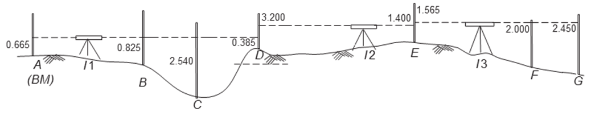

# Surveying and Leveling

## What is surveying ?

Surveying is an art of determining relative position of points on, below and above the earth surface, entering it graphically and Numerically.

### Objectives of Surveying?

- To determine relative position of points.
- To layout ou mark out proposed structure on the ground. 
- To measure relative quantities like volume.

## Technical Terms 
List Below are few important terminolgies, must be kept at mind.
### Leveling
- Leveling is the process of determining elevations at various points.
- Elevation is the height of a point above or below a reference level called datum.
- In typographical work most commonly used datum is mean sea level or (MSL).
- Mean Sea Level is obtained by averaging elevation of high and low tides at several points for a long period of time $(i.e 19 years)$.

### Datum
- It is a refrence level surface with refrence to which elevations are measured.

### Elevation
- It is the vertical Distance of a point above or below **Datum**.
- These are also termed as reduced level heights.
- Vertical distances are determined along line of gravity.

### Altitude
- It is the **height** of a point **above** **datum**.
- **Above datum**, altitude can be referred as *Elevation*

### BenchMark (B.M)
- It is a fixed point of known Reduced Level
- on the basis of degree and permanancy of the benchmark. 

### Types of Benchmarks:

1. **Great Trigonometrical Survey Benchmark:**  
   - It is a fixed point of known Reduced Level.

2. **Temporary Benchmark:**  
   - Based on the degree and permanency of the benchmark, they are categorized as temporary benchmarks.

3. **Permanent Benchmark:**  
   - It is a fixed point of known Reduced Level.
   - Considered permanent in nature.

4. **Arbitrary Benchmark:**  
   - It is a fixed point of known Reduced Level.
   - Typically established arbitrarily for specific purposes.

### Axis Of Telescope:
-  Axis of telescope is the line joining optical centre of objective glass & centre of eye piece.

### Line Of Sight:
- It is the line joining intersection of cross hair to the optical centre of objective.

### Line of Collination:
- When line of sight is horizontal, it is called "Line of Collination".
- It is the line joining intersection of cross hair to the optical centre of objective in continuation.

### Plane Of Collination:
- Horizontal plane formed by the 360 rotation of line of collination 

### Height Of Instrument
- It is the R.L of he Plane of Collination

### Station
- Station is a point of unknown elevation, Where staff is held readings.
  
### BackSight(B.S):
- It is the staff reading taken on a point of known elevation.
- It is first reading taken from after instrument is set up.
- Height of Instrument : $(R.L + B.M)$

### ForeSight
ForeSight is the reading taken on a last point of survey point of surveying or on a change point. i.e just before shifting of instrument.

Elevation of staff station = $(H.I - Foresight)$

### Change Point:
- Change point is the point of denoting shifting level.
- Both B.S and F.S are taken on change points.

### Intermediate Sight 
- Intermediate Sight is the reading taken on a point of unknown elevation between Backsight and Foresight.

- But F.S is taken either on change point or at last point of survey, Where as Intermediate Sight (I.S) is taken any other point.

## Methods For Calculation Of Reduced Level (R.L)

In surveying and leveling, there are two primary methods used to calculate reduced levels, which are "Height of Instrument (HI)" method and "Rise and Fall" method:

1. **Height of Instrument (HI) Method:**

    <iframe width="100%" height="315" src="https://www.youtube-nocookie.com/embed/kiOJR_lO-UY?si=ThdUGnMfQENDf0NL" title="YouTube video player" frameborder="0" allow="accelerometer; autoplay; clipboard-write; encrypted-media; gyroscope; picture-in-picture; web-share" allowfullscreen></iframe>

  
  
  
    - H.I = $(R.L + B.S)$ 
    - R.L = H.I - Staff Reading(can be I.S or F.S)
    - Arithmetic check = $(\Sigma B.S - \Sigma F.S)$ = $(Last R.L - First R.L)$
  
   - In this method, you start with a known elevation or reduced level, often a benchmark or a reference point, and then use a leveling instrument (such as a level or theodolite) to measure the height of the instrument above the ground at various points.
   - The difference between the known elevation and the observed height of the instrument at each point gives you the reduced level (RL) of that point.
   - It is a straightforward method and is commonly used for precise leveling tasks.

2. **Rise and Fall Method:**

    <iframe width="100%" height="315" src="https://www.youtube.com/embed/P_nn1ehp_LI?si=cCNzwiE77bLozg80" title="YouTube video player" frameborder="0" allow="accelerometer; autoplay; clipboard-write; encrypted-media; gyroscope; picture-in-picture; web-share" allowfullscreen></iframe>

 - Arithmetic check = $(\Sigma B.S - \Sigma F.S)$ = $(\Sigma Rise - \Sigma Fall)$ = $(Last R.L - First R.L)$ 

   - The Rise and Fall method is based on measuring the vertical differences in elevation between consecutive points along a survey line.
   - You start with a known reduced level at one point (usually the starting point) and then determine whether you are moving up or down as you progress along the survey line.
   - Whenever you encounter a change in elevation (either rising or falling), you record this as a "rise" or "fall" with its numerical value.
   - The reduced level at each point is calculated by adding the accumulated rises and subtracting the accumulated falls from the initial known reduced level.
   - This method is often used for rapid surveys and rough leveling work.

Both methods have their advantages and are chosen based on the specific requirements and precision needed for a surveying task. The HI method is more accurate and suitable for precise leveling, while the Rise and Fall method is quicker and often used for less precise tasks.